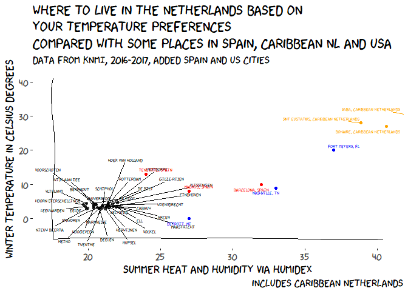

```{r setup, include=FALSE}
knitr::opts_chunk$set(echo = TRUE, warning = FALSE, message = FALSE)
```

According to this [post by Maële Salmon](http://www.masalmon.eu/2017/11/16/wheretoliveus/)
inspired by xkcd. We can determine our ideal city by looking at wintertemperature
and humidex (combination of humidity and summer heat). 

I've seen major cities in the us (post by Maelle) and where to live in
spain [by Claudia Guirao](https://twitter.com/claudiaguirao/status/931615734521909248).

Now I have to make this for the Netherlands too. 

endresult first:



A tiny detail...

The Netherlands is quite small and has essentially one climate. If we don't 
take the Caribean Netherlands into account.

According to the [world travel guide ](https://www.worldtravelguide.net/guides/europe/netherlands/weather-climate-geography/ "trying to disable copying from your website is essentially useless, world travelguide..., I just went to the source and copied it " ):

### Weather & climate

> There is never a bad time to visit the Netherlands, which has a moderate climate with warm summers (average 19&deg;C/66&deg;F) and relatively mild winters (average 3&deg;C/37&deg;F). That said, mid-April to mid-October is probably the best time to go, although coastal resorts and big cities like Amsterdam do get busy during the summer holidays (July-August) &#8211; higher prices reflect the increased demand. To see the country&rsquo;s famed bulb fields burst with colours, plan a trip to the Netherlands between mid-April and mid-May. You won&#8217;t be disappointed.

> Summers are generally warm with changeable periods, but excessively hot weather is rare. Pack a light jacket or sweater even in mid-summer. Winters can be fairly cold with the possibility of some snow. Rainfall is ever a possibility, and rainwear is advisable year-round.

You see the country is small. really small, the United States is about 237 times bigger than Netherlands.

* Horizontal Width: 164 km (101 miles) from The Hague, directly east to the German border
* Vertical Length: 262 km (162 miles) from Leeuwarden directly south to Maastricht 
*source:www.worldatlas.com, because I am lazy and don't know*


## Alright, fine so why would I want to know this?

If we do the analysis of cities in the Netherlands and their humidex and winter
temperature, I would expect practically no differences between cities. 

Randall Munroe (author of the XKCD comic) uses the winter temperature and 
humidex to classify countries. I use the average temperature over december, 
januari and februari for winter temperature and calculate the humidex using
the [comf package](https://cran.r-project.org/web/packages/comf/index.html).
This humidex is a combination of humidity and temperature. 


The [humidex](https://en.wikipedia.org/wiki/Humidex) (short for humidity index) is an index number used by Canadian meteorologists to describe how hot the weather feels to the average person, by combining the effect of heat and humidity. The term humidex is a Canadian innovation coined in 1965.

Range of humidex: Scale of comfort:[2][3]

- 20 to 29: Little to no discomfort
- 30 to 39: Some discomfort
- 40 to 45: Great discomfort; avoid exertion
- Above 45: Dangerous; heat stroke quite possible


### First determine all the cities

I just took all the available weatherstations provided by the Dutch weather 
service (KNMI, --- Royal Netherlands, Metereological Institute). There are 46
stations in the Netherlands.

The weatherservice has a nice interactive download page where you can specify
what you want (hourly, daily, which stations what things).  There is also a 
REST api, but this works fine for one-off projects.

### What is in the file?

```{r}
library(tidyverse)
read_lines("data/KNMI_20171018.txt",n_max = 5)
```

The first part is not so interesting. 
But the comments describing the stations and their position is.

```{r}
read_lines("data/KNMI_20171018.txt",n_max = 5,skip = 4)
```


The real data starts later on:

```{r}
stations <- read_csv("data/KNMI_20171018.txt",skip = 64, 
         col_names = c("STN","YYYYMMDD",   "daily_avg_temp",   "mm_rain",   "daily_hum", "ref_damp_crops"))
# YYYYMMDD = Datum (YYYY=jaar MM=maand DD=dag); 
# TG       = Etmaalgemiddelde temperatuur (in 0.1 graden Celsius); 
# RH       = Etmaalsom van de neerslag (in 0.1 mm) (-1 voor <0.05 mm); 
# UG       = Etmaalgemiddelde relatieve vochtigheid (in procenten); 
# EV24     = Referentiegewasverdamping (Makkink) (in 0.1 mm);
    
```

Now we have the staions and scores. Extract only winter and summer periods.
And select rows that are not missing

```{r}
summer <- stations %>% 
    filter(YYYYMMDD >= 20170601, YYYYMMDD <= 20170801)
winter <- stations %>% 
    filter(YYYYMMDD >= 20161201, YYYYMMDD <= 20170228)
#summer %>% count(missing = is.na(daily_avg_temp), STN, YYYYMMDD) %>% 
#    filter(missing) %>% count(STN)
# winter %>% count(missing = is.na(daily_avg_temp), STN, YYYYMMDD) %>% 
#     filter(missing) %>% count(STN)
# every station seems to have missing values, and the same number of missing values
# summer %>% count(missing = is.na(daily_avg_temp), STN, YYYYMMDD) %>% 
#     filter(missing) %>% count(YYYYMMDD)
summer <- summer %>% 
    filter(!is.na(daily_avg_temp), !is.na(daily_hum))
winter <- winter %>% 
    filter(!is.na(daily_avg_temp), !is.na(daily_hum))

```

Then calculate humidex. 
I will just use the package comf. 
The caclHumx function takes a ta = air temp in Celcius, and a rh 
relative humidity in %. 

We have those in the form of daily_avg temp, and daily_hum (although this one 
is in percent)

hmm that makes no sense I get values of hundreds. and above 45 is dangerous.
Of course I'm an idiot and the daily temperature was in centicelsius^[this is now a word].

I calculate the summer and wintervalues and recombine the data.

```{r}
library(comf)
wintervalues <- winter %>% 
    group_by(STN) %>% 
    summarize(wintertemp = mean(daily_avg_temp)/10)

summervalues <- summer %>% 
    mutate(humidex = calcHumx(ta = daily_avg_temp/10, rh = daily_hum)) %>% 
    group_by(STN) %>% 
    summarize(humidex_avg = mean(humidex))
combined <- full_join(wintervalues, summervalues, by = "STN")
```
Lets combine with the names and GPS positions.

```{r}
names_pos <- read_csv("data/names_positions")
result <- left_join(combined, names_pos, by = "STN")
```


## plot like xkcd
I am basically following the script of Mäelle here, because it is
so good!
On windows installation of the font doesn't work as advertised. Download the
font and double click on it. Windows smart screen asks if you want to install
the font and you OK it. This could be a security risk: only install things
with admin privilege if you trust the source! 

```{r temperatureranges in the netherlands}
library("xkcd")
library("ggplot2")
library("extrafont")
library("ggrepel")

xrange <- range(result$humidex_avg)
yrange <- range(result$wintertemp)

set.seed(3456)
ggplot(result,
       aes(humidex_avg, wintertemp)) +
  geom_point() +
  geom_text_repel(aes(label = NAME), family = "xkcd", 
                   max.iter = 50000, size = 3)+
  ggtitle("Where to live in The Netherlands \nbased on your temperature preferences",
          subtitle = "Data from KNMI, 2016-2017") +
  xlab("Summer heat and humidity via Humidex")+
  ylab("Winter temperature in Celsius degrees") +
  xkcdaxis(xrange = xrange,
           yrange = yrange)+
  theme_xkcd() +
  theme(text = element_text(size = 13, family = "xkcd"))

```

We can also plot it with the margins of the US:

```{r tempprefnlbasedonus}
xrange2 <- range(c(18,40))
yrange2 <- range(c(-5,40))
USA <- tribble(
      ~NAME, ~humidex_avg, ~wintertemp,
      "DETROIT, MI", 27, 0,
      "NASHVILLE, TN", 33, 9,
      "FORT MEYERS, FL",37, 20
  )
SPAIN <- tribble(
      ~NAME, ~humidex_avg, ~wintertemp,
      "MADRID, SPAIN", 27, 8,
      "TENERIFE, SPAIN", 24, 13,
      "BARCELONA, SPAIN",32, 10
  )
D_CARI <- tribble(
      ~NAME, ~humidex_avg, ~wintertemp,
      "Bonaire, Caribbean Netherlands", 27, calcHumx(29,76),
      "Sint Eustatius, Caribbean Netherlands", 28, calcHumx(28,77),   
      "Saba, Caribbean Netherlands",30, calcHumx(30,76)
  )

set.seed(3456)
ggplot(result,
       aes(humidex_avg, wintertemp)) +
  geom_point(alpha = .7) +
  geom_text_repel(aes(label = NAME),
                   family = "xkcd", 
                   max.iter = 50000, size = 2)+
  geom_text_repel(data = USA, aes(humidex_avg, wintertemp, label = NAME), family = "xkcd", 
                   max.iter = 50000, size = 2, color = "blue")+
    geom_point(data = USA, aes(humidex_avg, wintertemp), color = "blue")+
    geom_text_repel(data = SPAIN, aes(humidex_avg, wintertemp, label = NAME), family = "xkcd", 
                   max.iter = 50000, size = 2, color = "red")+
    geom_point(data = SPAIN, aes(humidex_avg, wintertemp),color = "red")+
    geom_text_repel(data = D_CARI, aes(humidex_avg, wintertemp, label = NAME), family = "xkcd", 
                   max.iter = 50000, size = 2, color = "orange")+
    geom_point(data = D_CARI, aes(humidex_avg, wintertemp), color = "orange")+
    labs(title = "Where to live in NL based on your temperature preferences ",
          subtitle = "Data from KNMI, 2016-2017, added Spain and US cities",
         x = "Summer heat and humidity via Humidex",
         y = "Winter temperature in Celsius degrees",
         caption = "includes Caribbean Netherlands Islands"
             ) +
  xkcdaxis(xrange = xrange2,
           yrange = yrange2)+
  theme_xkcd() +
  theme(text = element_text(size = 16, family = "xkcd"))
```


What if we plot the values on a map using their coordinates?

```{r}
NL <- map_data(map = "world",region = "Netherlands")
result %>% 
    rename(LON = `LON(east)`, LAT = `LAT(north)`) %>% 
    ggplot( aes(LON, LAT))+
    geom_point(aes(color = wintertemp))+
    geom_text_repel(aes(label = NAME),
                   family = "xkcd", size = 3,
                   max.iter = 50000)+
    geom_polygon(data = NL, aes(x=long, y = lat, group = group), fill = NA, color = "black") +
    coord_map()+
    labs(title = "Wintertemperature in NL",
         subtitle = "data from KNMI (2016,2017",
         x = "", y = "")+
    theme_xkcd()+
    theme(text = element_text(size = 16, family = "xkcd"))

```

```{r}
result %>% 
    rename(LON = `LON(east)`, LAT = `LAT(north)`) %>% 
    ggplot( aes(LON, LAT))+
    geom_point(aes(color = humidex_avg))+
    geom_text_repel(aes(label = NAME),
                   family = "xkcd", size = 3,
                   max.iter = 50000)+
    geom_polygon(data = NL, aes(x=long, y = lat, group = group), fill = NA, color = "black") +
    coord_map()+
    labs(title = "Humidex in NL",
         subtitle = "data from KNMI (2016,2017",
         x = "", y = "")+
    theme_xkcd()+
    theme(text = element_text(size = 12, family = "xkcd"))+
    scale_color_continuous(low = "white", high = "red")

```
