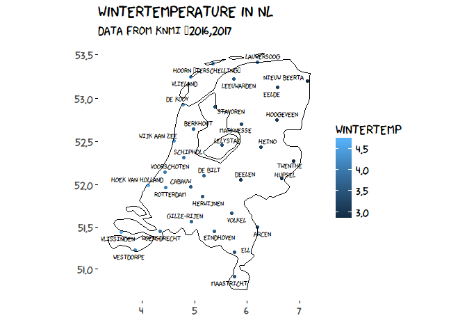
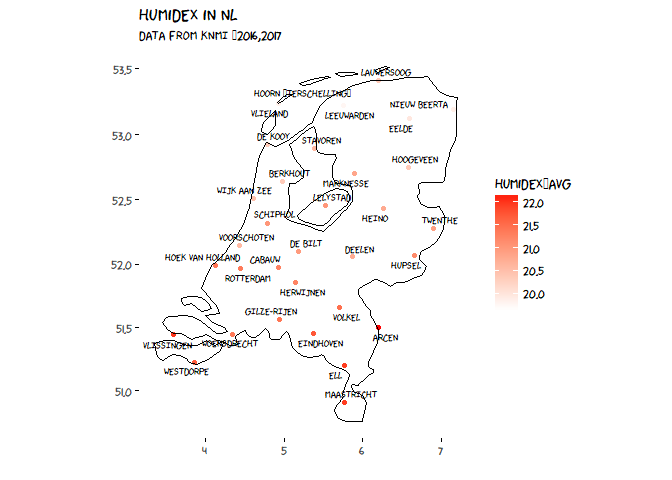

xkcd plot of netherlands weather
================

According to this [post by Maële Salmon](http://www.masalmon.eu/2017/11/16/wheretoliveus/) inspired by xkcd. we can determine ideal city by looking at wintertemperature and humidex (combination of humidity and summer heat)

I've seen major cities in the us (post by Maelle) and where to live in spain [by Claudia Guirao](https://twitter.com/claudiaguirao/status/931615734521909248).

Now I have to make this for the Netherlands too. A small detail...

The netherlands is quite small and has essentially one climate.

endresult first:


According to the [world travel guide](https://www.worldtravelguide.net/guides/europe/netherlands/weather-climate-geography/ "trying to disable copying from your website is essentially useless, world travelguide..."):

### Weather & climate

> There is never a bad time to visit the Netherlands, which has a moderate climate with warm summers (average 19°C/66°F) and relatively mild winters (average 3°C/37°F). That said, mid-April to mid-October is probably the best time to go, although coastal resorts and big cities like Amsterdam do get busy during the summer holidays (July-August) – higher prices reflect the increased demand. To see the country’s famed bulb fields burst with colours, plan a trip to the Netherlands between mid-April and mid-May. You won’t be disappointed.

> Summers are generally warm with changeable periods, but excessively hot weather is rare. Pack a light jacket or sweater even in mid-summer. Winters can be fairly cold with the possibility of some snow. Rainfall is ever a possibility, and rainwear is advisable year-round.

You see the country is small. really small, the United States is about 237 times bigger than Netherlands.

-   Horizontal Width: 164 km (101 miles) from The Hague, directly east to the German border
-   Vertical Length: 262 km (162 miles) from Leeuwarden directly south to Maastricht *source:www.worldatlas.com, because I am lazy and don't know*

Alright, fine so why would I want to know this?
-----------------------------------------------

If we do the analysis of cities in the Netherlands and their humidex and winter temperature, I would expect practically no differences between cities.

Lets go:

First determine all the cities

I just took all the available weatherstations provided by the Dutch weather service (KNMI, --- Royal Netherlands, Metereological Institute). The weatherservice has a nice interactive download page where you can specify what you want. There is also a REST api, but this works too.

``` r
library(tidyverse)
read_lines("data/KNMI_20171018.txt",n_max = 5)
```

    ## [1] "# BRON: KONINKLIJK NEDERLANDS METEOROLOGISCH INSTITUUT (KNMI)"                                                                                                                                                                                                                                                                                                                                                                                                                                                                                                                        
    ## [2] "# Opmerking: door stationsverplaatsingen en veranderingen in waarneemmethodieken zijn deze tijdreeksen van dagwaarden mogelijk inhomogeen! Dat betekent dat deze reeks van gemeten waarden niet geschikt is voor trendanalyse. Voor studies naar klimaatverandering verwijzen we naar de gehomogeniseerde reeks maandtemperaturen van De Bilt <http://www.knmi.nl/kennis-en-datacentrum/achtergrond/gehomogeniseerde-reeks-maandtemperaturen-de-bilt> of de Centraal Nederland Temperatuur <http://www.knmi.nl/kennis-en-datacentrum/achtergrond/centraal-nederland-temperatuur-cnt>."
    ## [3] "# "                                                                                                                                                                                                                                                                                                                                                                                                                                                                                                                                                                                   
    ## [4] "# "                                                                                                                                                                                                                                                                                                                                                                                                                                                                                                                                                                                   
    ## [5] "# STN      LON(east)   LAT(north)     ALT(m)  NAME"

The first part is not so interesting.

``` r
read_lines("data/KNMI_20171018.txt",n_max = 5,skip = 4)
```

    ## [1] "# STN      LON(east)   LAT(north)     ALT(m)  NAME"       
    ## [2] "# 209:         4.518       52.465       0.00  IJMOND"     
    ## [3] "# 210:         4.430       52.171      -0.20  VALKENBURG" 
    ## [4] "# 215:         4.437       52.141      -1.10  VOORSCHOTEN"
    ## [5] "# 225:         4.555       52.463       4.40  IJMUIDEN"

This is all just helpfull information The real data starts later on:

``` r
stations <- read_csv("data/KNMI_20171018.txt",skip = 64, 
         col_names = c("STN","YYYYMMDD",   "daily_avg_temp",   "mm_rain",   "daily_hum", "ref_damp_crops"))
# YYYYMMDD = Datum (YYYY=jaar MM=maand DD=dag); 
# TG       = Etmaalgemiddelde temperatuur (in 0.1 graden Celsius); 
# RH       = Etmaalsom van de neerslag (in 0.1 mm) (-1 voor <0.05 mm); 
# UG       = Etmaalgemiddelde relatieve vochtigheid (in procenten); 
# EV24     = Referentiegewasverdamping (Makkink) (in 0.1 mm);
```

Now we have the staions and scores. Extract only winter and summer periods. And select rows that are not missing

``` r
summer <- stations %>% 
    filter(YYYYMMDD >= 20170601, YYYYMMDD <= 20170801)
winter <- stations %>% 
    filter(YYYYMMDD >= 20161201, YYYYMMDD <= 20170228)
#summer %>% count(missing = is.na(daily_avg_temp), STN, YYYYMMDD) %>% 
#    filter(missing) %>% count(STN)
# winter %>% count(missing = is.na(daily_avg_temp), STN, YYYYMMDD) %>% 
#     filter(missing) %>% count(STN)
# every station seems to have missing values, and the same number of missing values
# summer %>% count(missing = is.na(daily_avg_temp), STN, YYYYMMDD) %>% 
#     filter(missing) %>% count(YYYYMMDD)
summer <- summer %>% 
    filter(!is.na(daily_avg_temp), !is.na(daily_hum))
winter <- winter %>% 
    filter(!is.na(daily_avg_temp), !is.na(daily_hum))
```

Then calculate humidex. I will just use the package comf. The caclHumx function takes a ta = air temp in Celcius, and a rh relative humidity in %.

We have those in the form of daily\_avg temp, and daily\_hum (although this one is in percent)

hmm that makes no sense I get values of hundreds. and above 45 is dangerous. Of course I'm an idiot and the daily temperature was in centicelsius[1].

``` r
library(comf)
wintervalues <- winter %>% 
    group_by(STN) %>% 
    summarize(wintertemp = mean(daily_avg_temp)/10)

summervalues <- summer %>% 
    mutate(humidex = calcHumx(ta = daily_avg_temp/10, rh = daily_hum)) %>% 
    group_by(STN) %>% 
    summarize(humidex_avg = mean(humidex))
combined <- full_join(wintervalues, summervalues, by = "STN")
```

Lets combine with the names and postitions.

``` r
names_pos <- read_csv("data/names_positions")
result <- left_join(combined, names_pos, by = "STN")
```

plot like xkcd I am basically just following the script of Mäelle here, because it is so good!

``` r
library("xkcd")
library("ggplot2")
library("extrafont")
library("ggrepel")

xrange <- range(result$humidex_avg)
yrange <- range(result$wintertemp)

set.seed(3456)
ggplot(result,
       aes(humidex_avg, wintertemp)) +
  geom_point() +
  geom_text_repel(aes(label = NAME),
                   family = "xkcd", 
                   max.iter = 50000, size = 3)+
  ggtitle("Where to live in The Netherlands \nbased on your temperature preferences",
          subtitle = "Data from KNMI, 2016-2017") +
  xlab("Summer heat and humidity via Humidex")+
  ylab("Winter temperature in Celsius degrees") +
  xkcdaxis(xrange = xrange,
           yrange = yrange)+
  theme_xkcd() +
  theme(text = element_text(size = 13, family = "xkcd"))
```


We can also plot it with the margins of the US:

``` r
xrange2 <- range(c(18,40))
yrange2 <- range(c(-5,25))
set.seed(3456)
ggplot(result,
       aes(humidex_avg, wintertemp)) +
  geom_point() +
  
  geom_text_repel(aes(label = NAME),
                   family = "xkcd", 
                   max.iter = 50000, size = 2)+
  geom_text_repel(data = tribble(
      ~NAME, ~humidex_avg, ~wintertemp,
      "DETROIT, MI", 27, 0,
      "NASHVILLE, TN", 33, 9,
      "FORT MEYERS, FL",37, 20
  ), aes(humidex_avg, wintertemp, label = NAME), family = "xkcd", 
                   max.iter = 50000, size = 2, color = "blue")+
    geom_text_repel(data = tribble(
      ~NAME, ~humidex_avg, ~wintertemp,
      "MADRID, SPAIN", 27, 8,
      "TENERIFE, SPAIN", 24, 13,
      "BARCELONA, SPAIN",32, 10
  ), aes(humidex_avg, wintertemp, label = NAME), family = "xkcd", 
                   max.iter = 50000, size = 2, color = "red")+
    ggtitle("Where to live in NL based on your temperature preferences ",
          subtitle = "Data from KNMI, 2016-2017, added Spain and US cities") +
  xlab("Summer heat and humidity via Humidex")+
  ylab("Winter temperature in Celsius degrees") +
  xkcdaxis(xrange = xrange2,
           yrange = yrange2)+
  theme_xkcd() +
  theme(text = element_text(size = 16, family = "xkcd"))
```


What if we plot the values on a map using their coordinates?

``` r
NL <- map_data(map = "world",region = "Netherlands")
result %>% 
    rename(LON = `LON(east)`, LAT = `LAT(north)`) %>% 
    ggplot( aes(LON, LAT))+
    geom_point(aes(color = wintertemp))+
    geom_text_repel(aes(label = NAME),
                   family = "xkcd", size = 3,
                   max.iter = 50000)+
    geom_polygon(data = NL, aes(x=long, y = lat, group = group), fill = NA, color = "black") +
    coord_map()+
    labs(title = "Wintertemperature in NL",
         subtitle = "data from KNMI (2016,2017",
         x = "", y = "")+
    theme_xkcd()+
    theme(text = element_text(size = 16, family = "xkcd"))
```



``` r
result %>% 
    rename(LON = `LON(east)`, LAT = `LAT(north)`) %>% 
    ggplot( aes(LON, LAT))+
    geom_point(aes(color = humidex_avg))+
    geom_text_repel(aes(label = NAME),
                   family = "xkcd", size = 3,
                   max.iter = 50000)+
    geom_polygon(data = NL, aes(x=long, y = lat, group = group), fill = NA, color = "black") +
    coord_map()+
    labs(title = "Humidex in NL",
         subtitle = "data from KNMI (2016,2017",
         x = "", y = "")+
    theme_xkcd()+
    theme(text = element_text(size = 12, family = "xkcd"))+
    scale_color_continuous(low = "white", high = "red")
```



[1] this is now a word
